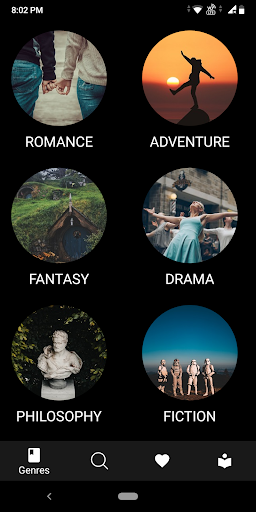
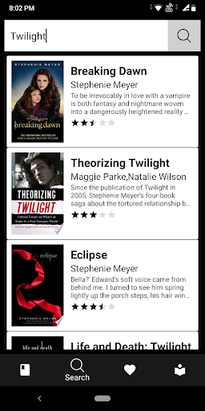
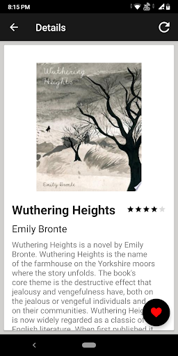
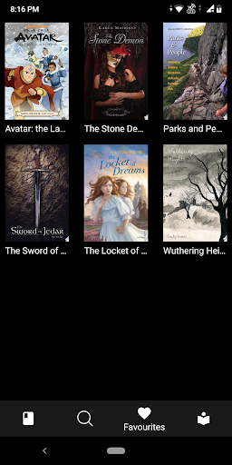
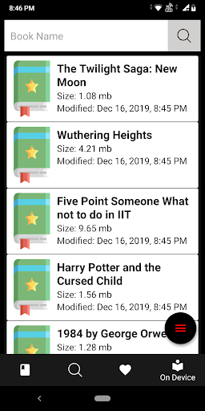
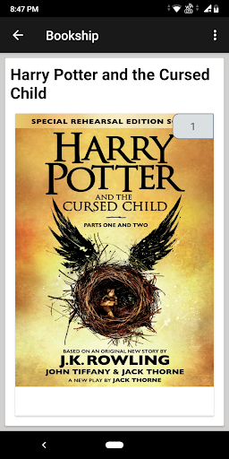

# Bookship
An android app that lets you discover and read the books you love and add them to your
favorites using Google Books API and SQL database. It also provide a friendly to read the ondevice
pdf's.

## Below are some screenshots of the app

<table>
	<tr>
		<td>  </td>
		<td>  </td>
		<td>  </td>
	</tr>
	<tr>
		<td>  </td>
		<td>  </td>
		<td>  </td>
	</tr>
</table>
